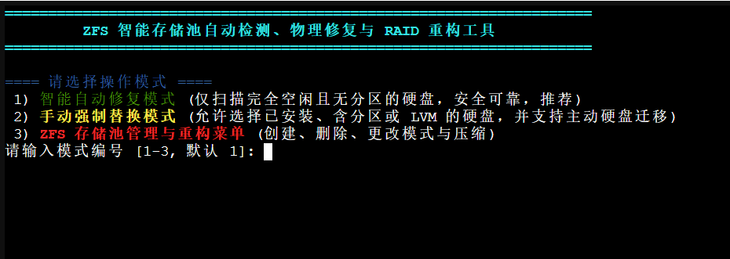
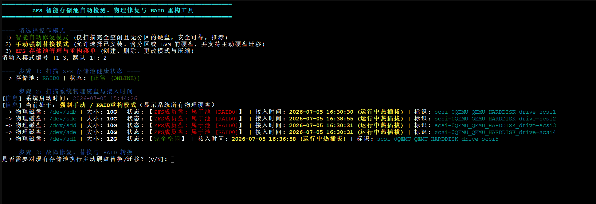
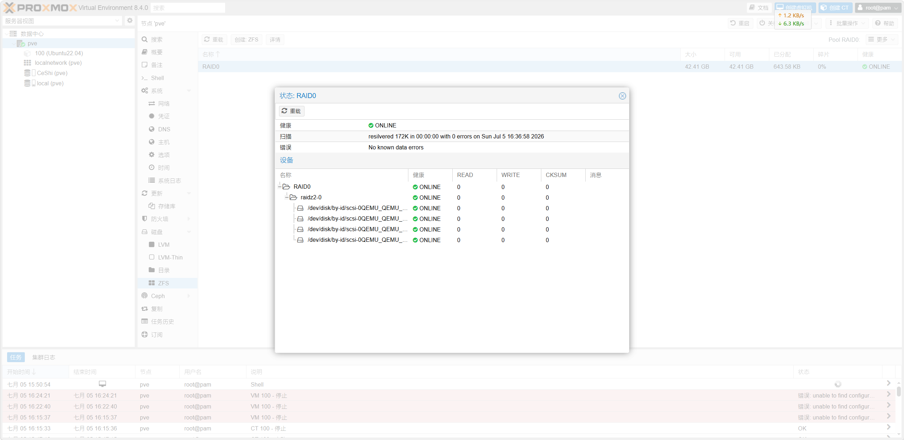

# ZFS 智能存储池管理与极速修复工具 (Proxmox VE 专属版)

[](https://pve.proxmox.com)
[](https://openzfs.github.io/openzfs-docs/)
[](LICENSE)

本工具是专为 **Proxmox VE (PVE)** 虚拟化平台量身定制的 ZFS 存储池智能运维脚本。它旨在将原本繁琐、高风险的 ZFS 底层存储命令行操作，封装为安全、直观、美观的彩色交互式菜单控制台。支持**物理磁盘热插拔检测**、**故障全自动匹配修复**、**硬盘健康迁移与对调**、**存储池彻底重构/扩容**，并能**动态联动 PVE `/etc/pve/storage.cfg` 存储配置文件**，使网页端和终端保持完美同步。

---

## 📸 运行界面预览

### 1. 操作模式主菜单
当您启动本工具时，将看到三种操作模式的切换菜单：



### 2. 物理磁盘与系统启动/接入时间扫描
脚本会只读扫描系统物理盘（严格屏蔽 PVE 系统根磁盘 `/dev/sda`），并分析其是否属于 ZFS 池、是否包含分区、以及其是在开机时随系统启动的还是开机后热插拔的：



### 3. 主动硬盘替换与数据迁移
在手动模式下，即使存储池完全健康，您也可以在备用硬盘插入后，自由将池中的老硬盘迁移到新硬盘上：


### 4. ZFS 存储池重构与 RAID 切换
在重构菜单下，支持对已有池进行销毁、重建、重命名，支持图三的所有 RAID 级别和图二的所有压缩算法选择：


### 5. Proxmox VE 网页端同步显示
无论是修改存储池名字还是重建 RAID 模式，脚本都会自动通过 PVE `pvesm` 命令进行联动，使 PVE 网页端的存储状态和物理设备树形图同步展现：



---

## ⚡ 一键安装到系统变量 (终端全局唤醒)

为了让您随时随地在终端调用本工具，我们提供了一键安装指令。该指令会将脚本拷贝到系统的全局执行路径 `/usr/local/bin/` 下，赋予权限，并注册系统变量。

### 安装命令
在 PVE 终端下执行以下一键安装指令：
```bash
# 1. 复制脚本至全局系统变量路径
cp /root/zfs_repair.sh /usr/local/bin/zfsrepair

# 2. 赋予全局可执行权限
chmod +x /usr/local/bin/zfsrepair

# 3. 重新加载系统环境变量
hash -r
```

### 启动方式
安装成功后，在终端的**任意目录下**输入以下命令，即可直接唤醒并运行本工具：
```bash
zfsrepair
```

---

## 🎨 终端彩色高亮区分规则 (对新手小白极其友好)

脚本在终端交互中使用了精心调配的高亮颜色，以帮助您在错综复杂的物理磁盘列表中，精准定位磁盘状态：

*   **红色 (`RED`)**：
    *   `【ZFS成员盘: 属于池 [xxx]】`：表示该磁盘目前正绑定于特定的 ZFS 活动池中，**属于在线生产设备**。
    *   `[危险]` / `[故障]`：高风险毁灭性警告（如删除池、格式化警告）或已发生的物理故障提示。
*   **黄色 (`YELLOW`)**：
    *   `【已占用: lvm/part】`：表示该磁盘上被检测到了未在 ZFS 中的其他分区表或 LVM 卷。
    *   `[2026-07-05 16:15:37 (运行中热插拔)]`：设备加载时间戳为黄色，代表此磁盘是**在开机后插入的，或开机后被重新拔插过**。
*   **绿色 (`GREEN`)**：
    *   `【完全空闲】`：表示这块硬盘**十分干净**，没有被挂载、没有 LVM，也没有 ZFS 残留，**可安全放心地用于修复、替换或组建新存储池**。
    *   `[正常 (ONLINE)]` / `[成功]`：状态良好及操作成功的标志。
*   **青色 (`CYAN`)**：
    *   `[2026-07-05 15:44:29 (随系统启动)]`：代表该磁盘在服务器开机阶段就存在，自始至终未曾中断连接。
    *   磁盘唯一的物理 `by-id` 序列号路径。
*   **紫色 (`PURPLE`)**：
    *   系统的精确启动（开机）时间点。

---

## 📖 核心功能详解与使用方法

### 1️⃣ 模式一：智能自动修复模式
*   **用途**：最安全的自动化坏盘修复。
*   **动作**：
    1. 自动定位 ZFS 存储池中处于 `REMOVED` 或 `FAULTED` 的缺失旧磁盘 ID。
    2. 自动匹配系统中完全空闲（`【完全空闲】`）的新磁盘。
    3. 如果新盘容量不小于旧盘，自动执行 `zpool replace`。
    4. **数据同步**：重构 (Resilvering) 将在后台自动开始。在此期间您可以断开终端，ZFS 会在后台利用校验数据重新把内容填入新盘。

### 2️⃣ 模式二：手动强制替换模式 (支持主动迁移)
*   **用途**：应对复杂环境下的磁盘调整（如用更大容量的新盘对换掉池中尚且健康的小硬盘）。
*   **步骤**：
    1. 选择需要操作的存储池（如 `RAID5` 或 `RAID0`）。
    2. 选择想要卸载掉的旧磁盘 ID。
    3. 选择作为替代的目标新磁盘。
    4. **安全阀保护**：如果目标盘包含分区或残留，脚本会红字警告，您必须在终端手动敲入大写的 `YES` 确认数据抹除，才会执行强制覆盖，防止选错系统盘或有用数据盘。

### 3️⃣ 模式三：ZFS 存储池管理与重构菜单
提供三个强大的子选项，深度联动 Proxmox VE 系统配置：

#### 选项 A：创建全新存储池
1. 自定义池名称。
2. 选择 RAID 模式，输入要使用的空闲磁盘编号（空格分隔），系统执行限制校验。
3. 选择压缩算法，创建成功后，调用 `pvesm add` **自动在 PVE 后台注册该 ZFS 存储区**。

#### 选项 B：删除已有存储池
1. 精准列出当前所有的活动存储池。
2. **PVE 虚拟机及容器保护**：扫描 PVE 的虚机配置文件，如果检测到有虚拟机（如虚拟机 ID 100）的虚拟硬盘存放在该池中，会输出红色警示阻止误删。
3. 必须手动输入大写的 `CONFIRM_DELETE` 才会执行销毁。
4. 销毁前会自动停止关联的虚机/容器，并自动在 PVE 后台执行 `pvesm remove` **注销该存储空间，清除挂载残留**。

#### 选项 C：重构现有存储池 (销毁并更改 RAID 模式/压缩/重命名)
1. 允许您自主选择对存储池进行**重命名**（如从原先默认的 `RAID5` 重命名为 `RAID0` 或 `CeShi`）。
2. 在停止虚机、注销原 PVE 存储并销毁原池后，会以全新的 RAID 模式和压缩配置重新生成新池，并**以新名字自动重新绑定到 PVE 系统中**。

---

## 📋 存储池模式与压缩限制表

### RAID 级别最少硬盘数及容错说明
| 模式序号 | ZFS 模式 (PVE 映射) | 最小硬盘数 | 容错/冗余能力说明 |
| :---: | :--- | :---: | :--- |
| **1** | **单磁盘 (Single / Stripe)** | 1 块 | 无容错。磁盘若损坏，数据全部丢失。 |
| **2** | **Mirror (镜像)** | 2 块 | 1:1 双副本，容错最高。只要有一块盘存活，数据即完整。可用容量折半。 |
| **3** | **RAID10 (条带镜像组)** | 4 块 (偶数) | 双向 Mirror 组成的 Stripe 组。在每组镜像不全损坏的前提下，最多支持损坏一半磁盘。 |
| **4** | **RAIDZ (类似 RAID5)** | 3 块 | 奇偶校验容错。允许同时损坏任意 1 块磁盘而不丢失数据。 |
| **5** | **RAIDZ2 (类似 RAID6)** | 4 块 | 双重奇偶校验。允许同时损坏任意 2 块磁盘。数据安全性极高。 |
| **6** | **RAIDZ3** | 5 块 | 三重奇偶校验。允许同时损坏任意 3 块磁盘。适合大规模存储。 |
| **7** | **dRAID (分布式 RAIDZ)** | 3 块 | 拥有集成分布式热备盘的快速重构模式。允许坏 1 块盘。 |
| **8** | **dRAID2 (分布式 RAIDZ2)** | 4 块 | 拥有集成分布式热备盘的快速重构模式。允许坏 2 块盘。 |
| **9** | **dRAID3 (分布式 RAIDZ3)** | 5 块 | 拥有集成分布式热备盘的快速重构模式。允许坏 3 块盘。 |

### 压缩算法对比
*   **`lz4` (默认推荐)**：几乎不消耗额外的 CPU 算力，但却能带来约 1.2x - 1.5x 的实际容量放大，读写吞吐速度更流畅。
*   **`zstd`**：拥有非常高的压缩比例。适合于大容量冷数据存放、归档备份。
*   **`gzip`**：虽然压缩率高，但重度消耗 CPU 算力，PVE 虚拟机高 IO 时容易造成系统卡顿。
*   **`off`**：完全关闭 ZFS 数据压缩。

---

## 📂 项目包内文件结构与映射

当您获取到 `文档.zip` 后，其内容与您本地文件夹的映射关系如下：
*   `zfs_docs/README.md`：本项目说明文档（即本页面）。
*   `zfs_docs/zfs_repair.sh`：ZFS 极速修复工具脚本。
*   `zfs_docs/images/1_menu.png`：主菜单操作截图。
*   `zfs_docs/images/2_scan.png`：物理磁盘列表与热插拔时间截图。
*   `zfs_docs/images/3_replace.png.txt.png`：主动替换硬盘交互截图。
*   `zfs_docs/images/4_rebuild.png.txt.png`：重构存储池命令行截图。
*   `zfs_docs/images/5_pve_gui.png`：PVE 网页端同步拓扑截图。
